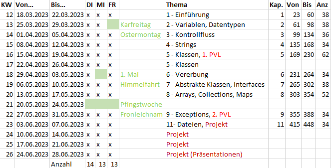

<!--
author: Alexander Rausch
language: de
version: 0.0.6
narrator: Deutsch Male
mode: Textbook

comment: Vorlesung Programmieren 1 an der HFT Stuttgart

import: https://raw.githubusercontent.com/liascript/CodeRunner/master/README.md

-->
# Organisation der Lehrveranstaltung Programmieren 1

Für das Modul "Programmieren 1" der Studiengänge Informatik und Wirtschaftsinformatik gelten dieselben Inhalte, organisatorischen Regeln und Prüfungsmodalitäten.

## DozentInnen

Das Lehrpersonal besteht aus folgenden Personen:

* Prof. Dr. Melanie Baur (organisatorisch für die Informatik)
* Prof. Dr. Alexander Rausch (organisatorisch für die Wirtschaftsinformatik)

Beide ProfessorInnen helfen Ihnen ungeachtet Ihrer Zugehörigkeit zu einem bestimmten Studiengangs.

## Stundenplan

Die SPO legt den Vorlesungsumfang auf 6 SWS, d.h. 3 Zeitblöcke zu je 90 Minuten fest.
* In der **Vergangenheit**
 gab es einen Zeitblock *Theorie* (Frontal-Vorlesung, Prof als "Leithammel", 90 Minuten) und zwei Zeitblöcke *Praxis* (Selbständiges Lösen von Aufgaben, Prof als "Coach", 3 Stunden).
* In **diesem Semester** erarbeiten Sie die *Theorie* in eigenem Tempo anhand des öffentlich zugänglichen (Lia-)Skripts. Das Skript mischt theoretische Inhalte und praktische Aufgaben. In jeder Woche haben Sie die Möglichkeit, sowohl die drei für Ihren jeweiligen Studiengang vorgesehenen Zeitblöcke als auch die des anderen Studiengangs zu besuchen.

Beide ProfessorInnen arbeiten als Team. Die Stundenpläne der Studiengänge Informatik bzw. Wirtschaftsinformatik sind bewusst so gestaltet, dass Sie alle 6 Zeitblöcke besuchen können. Wir bieten Ihnen also das **doppelte Unterstützungsangebot**, das normalerweise verfügbar ist


| | Montag | Dienstag | Mittwoch | Donnerstag | Freitag |
|-|:--------:|:----------:|:----------:|:------------:|---------|
|08:00 - 09:30||| Baur / Rausch|||
|09:45 - 11:15||| Baur / Rausch|||
|11:30 - 13:00||||||
|||||||
|14:00 - 15:30|||||Rausch|
|15:45 - 17:15||Baur|||Rausch|
|17:30 - 19:00||Baur||||

## Semesterplan

<p align="center">

</p>

## Didaktisches Vorgehen

Zunächst müssen wir uns mit zwei Kennzahlen aus der SPO beschäftigen. Für das Modul "Programmieren 1" finden sich folgende Angaben in der SPO:

| Studiengang | SWS | CP |
|-|-|-|
|Informatik|6|7|
|Wirtschaftsinformatik|6|8|

* SWS: Eine Einheit bedeutet, dass die Veranstaltung wöchentlich [[45]] Minuten lang gelehrt wird.
* CP (oder ECTS): Eine Einheit bedeutet, dass für den Studienerfolg erforderliche Workload (d.h. Unterricht mit Vor- und Nachbereitung, Selbststudium und Prüfungsvorbeitung) [[25]] bis [[30]] Arbeitsstunden beträgt.

Wir können jetzt den durchschnittlichen wöchentliche Lernaufwand für das Modul berechnen (lassen):

```java
class HalloWelt{
    public static void main(String args[]){
        int anzahlWochen = 14; // Ferienwoche nicht eingerechnet
        int cp = 8;
        int zeitProCP = 25; // interpretationsabh. zwischen 25 und 30 Stunden
        double wochenaufwand = Math.round(cp * zeitProCP *10.0 / anzahlWochen)/10.0 ; 
        System.out.println("Wochenaufwand = " + wochenaufwand + " Stunden");
        System.out.println("");
        
        double stundenProSws = 45.0/60; // 1 SWS = 45 Minuten pro Woche       
        System.out.println("Wöchentliche Betreuungszeit:");
        System.out.print("Laut SPO:   " + 6*stundenProSws + " Stunden");
        System.out.println(" --> Zu Hause: " + (wochenaufwand - 6*stundenProSws));
        System.out.print("Unser Kurs: " + 12*stundenProSws + " Stunden");
        System.out.println(" --> Zu Hause: " + (wochenaufwand - 12*stundenProSws));
    }
}

```
@LIA.java(HalloWelt)

## Prüfung

Die Prüfungsleistung besteht auf folgenden Teilen:

| | | |
|-|-|-|
|1. Teilprüfung|17.4.2024| 40 %|
|2. Teilprüfung|29.5.2024| 40 %|
|Bewertetes Programmierprojekt in 2er-Teams|3.6.2023 - 28.6.2023| 20 % |
|-|-|-|

## Moodle

Registrieren Sie sich im Moodlekurs. Dort finden Sie alle Unterlagen. Nachrichten werden ausschließlich an die dort registrierten Studierenden verschickt.

## Literatur 

* Philip Ackermann, Schrödinger programmiert Java, als E-Book in der HFT-Bibliothek verfügbar.
<p align="center">

</p>

## Tipps

* Machen Sie sich die **hohen** Erwartungen bzgl. des Lernaufwands bewusst.
* Bleiben Sie inhaltlich synchron zum Semesterplan.
* Bilden Sie Lerngruppen (2-3 Personen)
* Lesen Sie täglich Ihre E-Mails
